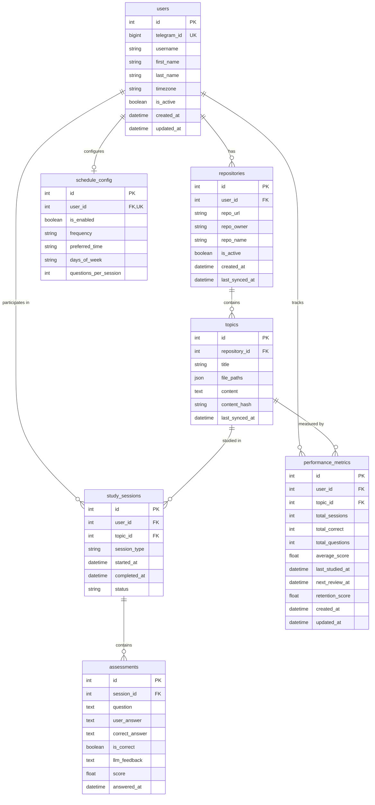

# Database Entity Relationship Diagram

## ERD Diagram

## Table Descriptions

| Entity | Description |
|--------|-------------|
| **users** | Stores Telegram user information with timezone preferences |
| **repositories** | GitHub repositories linked to users (unique per user+owner+name) |
| **topics** | Study topics extracted from repository content |
| **study_sessions** | Tracks individual study sessions (scheduled/manual) |
| **assessments** | Questions and answers within a study session |
| **performance_metrics** | Aggregated performance data per user+topic (unique constraint) |
| **schedule_config** | User's scheduling preferences (one-to-one with user) |

## Relationships

- **User → Repositories**: One-to-many (user owns multiple repos)
- **User → Study Sessions**: One-to-many (user has multiple sessions)
- **User → Performance Metrics**: One-to-many (metrics per topic)
- **User → Schedule Config**: One-to-one (single config per user)
- **Repository → Topics**: One-to-many (repo contains multiple topics)
- **Topic → Study Sessions**: One-to-many (topic studied multiple times)
- **Topic → Performance Metrics**: One-to-many (tracked per user)
- **Study Session → Assessments**: One-to-many (session has multiple Q&A)
